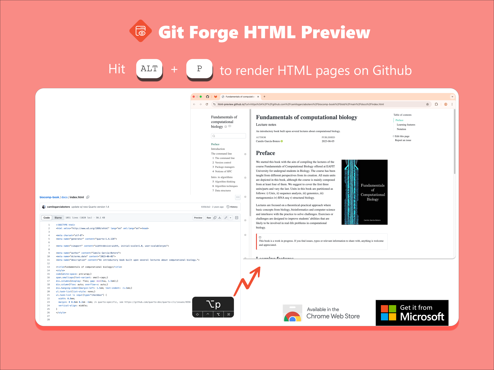

  

# 🔶👁️ Git Forge HTML Preview Web Extension

Git Forge HTML Preview lets you instantly render HTML files hosted on platforms like GitHub, GitLab, Bitbucket, and more.

Powered by the popular open source project, [html-preview/html-preview.github.io](https://github.com/html-preview/html-preview.github.io), it’s designed for developers, designers, and researchers working with static site generator such as Quarto.

## Demo

## Features

This web extension redirects HTML files from Git forges like GitHub, GitLab, Bitbucket to the [html-preview.github.io](https://html-preview.github.io/) without needing to open the website manually.

You can open the preview in three ways:

- **via a keyboard shortcut.** (`Alt+P` or `Option+P`)

  - It is configurable via `chrome://extensions/shortcuts`

- from the **right-click context menu**
- or **using a 'Preview' button on GitHub**.

## Inspiration

This extension is driven by my regular use of [html-preview/html-preview.github.io](https://github.com/html-preview/html-preview.github.io). Constantly switching between GitHub and the html-preview site introduced unnecessary context switching, which disrupted my workflow.

Inspired by existing web extensions like [Github Html Preview](https://chromewebstore.google.com/detail/github-html-preview/pmpjligbgooljdpakhophgddmcipglna) which make the same task a seamless experience via a button, I built on top of these ideas to further improve functionality with keyboard shortcuts and context menu access.

Note that existing web extensions use different implementations to render HTML files, so the output may vary.

For more details, see my [writeup](https://walterteng.com/html-preview-web-extension).

## Installation

You can install this web extension directly from the [Chrome Web Store](https://chromewebstore.google.com/detail/git-forge-html-preview-in/gfhpdagbjajommngkcloffbfbmfhakcb) or [Microsoft Edge Addons](https://microsoftedge.microsoft.com/addons/detail/git-forge-html-preview-i/hphhimlmjdamgileaijcgldhfcghagam).

### Local Installation

If you want to install the extension locally, follow these steps:

1. Clone or download this repo
2. Go to `chrome://extensions`
3. Enable Developer Mode
4. Click Load unpacked
5. Select the `public` folder in the cloned repo
6. The extension should now be installed and ready to use!

## Contributing

This extension is built primarily for Github. For example, the `Preview` button is only available for github.

However, it already support other Git forges like GitLab and Bitbucket via context menu and shortcut keys. If you want to contribute to support UI element for other Git forges, please feel free to fork this repo and create a pull request.
